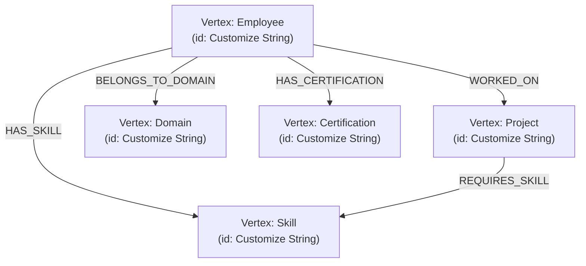

# Graph Schema Documentation

This document describes the schema design implemented in **Apache HugeGraph** for the Employee Resource Discovery System.

## Schema Layout (Mermaid)

---

## 1. Property Keys

| Property Name | Type | Description |
| :--- | :--- | :--- |
| `name` | `Text` | The name of the employee, skill, project, domain, or certification. |
| `experience_years` | `Int` | Years of work experience for an employee. |
| `location` | `Text` | Base office location of the employee (e.g. Bangalore, Pune). |
| `status` | `Text` | Availability status: `ON_PROJECT` or `BENCH`. |
| `designation` | `Text` | Role: `Trainee`, `Developer`, `Senior Developer`, `Lead`, `Architect`. |
| `domain` | `Text` | The business domain of a project (e.g. Banking, Retail). |

---

## 2. Vertex Labels

All vertices use the **`CUSTOMIZE_STRING`** ID strategy. This allows the client to assign unique string IDs directly (such as `E0101`, `S005`, `P022`), bypassing auto-generated numeric IDs and making Gremlin queries highly readable.

| Vertex Label | Properties | ID Format | Example ID |
| :--- | :--- | :--- | :--- |
| **`Employee`** | `name`, `experience_years`, `location`, `status`, `designation` | `E{number:04d}` | `E0102` |
| **`Skill`** | `name` | `S{number:03d}` | `S001` (Python) |
| **`Project`** | `name`, `domain` | `P{number:03d}` | `P005` (Fraud Detection System) |
| **`Domain`** | `name` | `D{number:03d}` | `D001` (Banking) |
| **`Certification`**| `name` | `C{number:03d}` | `C001` (AWS Associate) |

---

## 3. Edge Labels

Edges define the relationships between vertices.

| Edge Label | Source Label | Target Label | Properties | Description |
| :--- | :--- | :--- | :--- | :--- |
| **`HAS_SKILL`** | `Employee` | `Skill` | None | Skills possessed by the employee. |
| **`WORKED_ON`** | `Employee` | `Project` | None | Projects the employee has worked on previously. |
| **`HAS_CERTIFICATION`**| `Employee`| `Certification`| None | Certifications earned by the employee. |
| **`BELONGS_TO_DOMAIN`**| `Employee` | `Domain` | None | Primary domain specialization. |
| **`REQUIRES_SKILL`** | `Project` | `Skill` | None | Skills required to staff the project. |

---

## 4. Index Labels

Indexes are critical in HugeGraph. Attempting to filter vertices by property values (e.g. `has('status', 'BENCH')`) without a corresponding secondary or range index will throw a server exception.

| Index Name | Target Vertex | Property Indexed | Index Type | Purpose |
| :--- | :--- | :--- | :--- | :--- |
| `employeeByStatus` | `Employee` | `status` | `Secondary` | Find bench/assigned employees. |
| `employeeByLocation` | `Employee` | `location` | `Secondary` | Filter employees by office city. |
| `employeeByDesignation`| `Employee` | `designation` | `Secondary` | Filter employees by experience level. |
| `employeeByExperience` | `Employee` | `experience_years`| `Range` | Query by experience thresholds (e.g. `exp > 5`). |
| `skillByName` | `Skill` | `name` | `Secondary` | Find skill vertex by name (e.g. 'Python'). |
| `projectByName` | `Project` | `name` | `Secondary` | Find project vertex by name. |
| `domainByName` | `Domain` | `name` | `Secondary` | Find domain vertex by name. |
| `certificationByName` | `Certification`| `name` | `Secondary` | Find certification vertex by name. |
